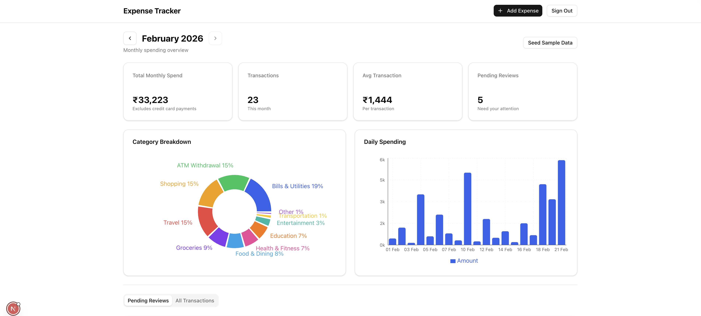

# Expense Tracker

A personal expense tracking dashboard that automatically parses Indian bank alert emails using Gmail API and Google Gemini AI to extract and categorize debit transactions.

Built with Next.js 16, React 19, Prisma, and Tailwind CSS.



## Features

- **Automatic email parsing** — Fetches bank alert emails from Gmail and extracts transactions using Gemini AI with structured output
- **AI-powered categorization** — Transactions are automatically categorized into 13 default categories with confidence scoring
- **Review workflow** — Low-confidence extractions (< 80%) are flagged for manual review with approve/edit/delete actions
- **Manual entry** — Add transactions manually when needed
- **Monthly dashboard** — Summary cards, category breakdown pie chart, and daily spending bar chart
- **Credit card payment tracking** — CC payments are tracked separately and excluded from spend totals to avoid double-counting
- **Duplicate detection** — Deduplicates by email message ID and flags potential same-day/amount/merchant matches
- **Custom categories** — Create new categories on the fly
- **Single-user auth** — Simple password-based authentication via NextAuth v5

### Supported Banks

Out of the box, the email parser targets:

- **HDFC Bank** — `alerts@hdfcbank.net`, `alerts@hdfcbank.bank.in`
- **IDFC FIRST Bank** — `noreply@idfcfirstbank.com`, `delivery.idfcfirstbank.com`

You can add support for other banks by setting the `GMAIL_SEARCH_QUERY` environment variable with a custom Gmail search query.

## Tech Stack

- **Framework**: Next.js 16 (App Router, Server Components, Server Actions)
- **Language**: TypeScript (strict mode)
- **Database**: PostgreSQL via Prisma 7
- **AI**: Google Gemini 2.5 Flash via Vercel AI SDK
- **Email**: Gmail API (OAuth 2.0)
- **Auth**: NextAuth v5 (credentials provider)
- **UI**: Tailwind CSS 4, shadcn/ui, Recharts, Lucide icons
- **Validation**: Zod 4

## Getting Started

### Prerequisites

- Node.js 18+
- PostgreSQL database
- Google Cloud project with Gmail API enabled
- Gemini API key

### 1. Clone and install

```bash
git clone https://github.com/narendran-kannan/expense-tracker.git
cd expense-tracker
npm install
```

### 2. Configure environment variables

```bash
cp .env.example .env
```

Edit `.env` with your values. See [`.env.example`](.env.example) for detailed descriptions of each variable.

**Key variables:**

| Variable | Description |
|---|---|
| `DATABASE_URL` | PostgreSQL connection string |
| `AUTH_SECRET` | Random secret for NextAuth (`openssl rand -base64 32`) |
| `AUTH_PASSWORD` | Your dashboard login password |
| `GOOGLE_GENERATIVE_AI_API_KEY` | Gemini API key from [AI Studio](https://aistudio.google.com/app/apikey) |
| `GMAIL_CLIENT_ID` | Gmail OAuth 2.0 client ID |
| `GMAIL_CLIENT_SECRET` | Gmail OAuth 2.0 client secret |
| `GMAIL_REFRESH_TOKEN` | Gmail refresh token (use [OAuth Playground](https://developers.google.com/oauthplayground)) |
| `CRON_SECRET` | Secret to protect the email processing endpoint |

### 3. Set up the database

```bash
npx prisma generate
npx prisma db push
```

### 4. Run the dev server

```bash
npm run dev
```

Open [http://localhost:3000](http://localhost:3000) and log in with your `AUTH_PASSWORD`.

### 5. Seed sample data (optional)

Click the "Seed Sample Data" button on the dashboard in development mode, or run:

```bash
curl -X POST http://localhost:3000/api/seed
```

## Email Processing

The `/api/process-emails` endpoint fetches and parses bank alert emails. You can trigger it:

**Manually (dev):**
```bash
curl http://localhost:3000/api/process-emails
```

**As a cron job (production):**
```bash
curl -H "Authorization: Bearer $CRON_SECRET" https://your-domain.com/api/process-emails
```

Supports `?dry_run=true` to preview without saving and `?verbose=true` for detailed logs.

## Gmail API Setup

1. Go to [Google Cloud Console](https://console.cloud.google.com/)
2. Create a new project (or select an existing one)
3. Enable the **Gmail API**
4. Create **OAuth 2.0 credentials** (Desktop app type)
5. Go to [OAuth Playground](https://developers.google.com/oauthplayground)
6. Configure it to use your own OAuth credentials (gear icon)
7. Authorize the `https://www.googleapis.com/auth/gmail.modify` scope
8. Exchange the authorization code for a refresh token
9. Add the client ID, client secret, and refresh token to your `.env`

## Deployment

Deploy to any platform that supports Next.js. For Vercel:

```bash
npm run build   # Runs: prisma generate && prisma db push && next build
```

Set all environment variables from `.env.example` in your deployment platform's settings.

## License

[MIT](LICENSE)
